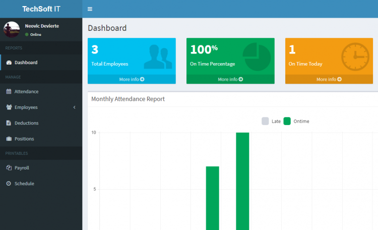

# Attendance and Payroll System using PHP/MySQLi

 

### Description

This is a simple Attendance and Payroll System using PHP and MySQLi-OOP as DB driver. It has attendance on the client-side and payroll on the admin side. This system is written in pure PHP with no framework so it is understandable to beginners.

### Features

<ul>
  <li><strong>CRUD - Employee Attendance</strong></li>
  <li><strong>CRUD - Employee</strong></li>
  <li><strong>Employee Cash Advance</strong></li>
  <li><strong>Employee Overtime</strong></li>
  <li><strong>Employee Schedule</strong></li>
  <li><strong>Payroll on Date Range</strong></li>
  <li><strong>Payslip on Date Range</strong></li>
</ul>

Visit [sourcecodester.com](https://www.sourcecodester.com/php/12268/attendance-and-payroll-system-using-php.html) for more details about this PHP Project.

### Website Info
| Title | Attendance and Payroll System using PHP/MySQLi Source Code |
|:---|:---|
| Website | [www.sourcecodester.com](https://www.sourcecodester.com) |
| Link | https://www.sourcecodester.com/php/12268/attendance-and-payroll-system-using-php.html |
| Language | PHP |
| Developer/Uploader | [nurhodelta_17](https://www.sourcecodester.com/users/nurhodelta2017) |
